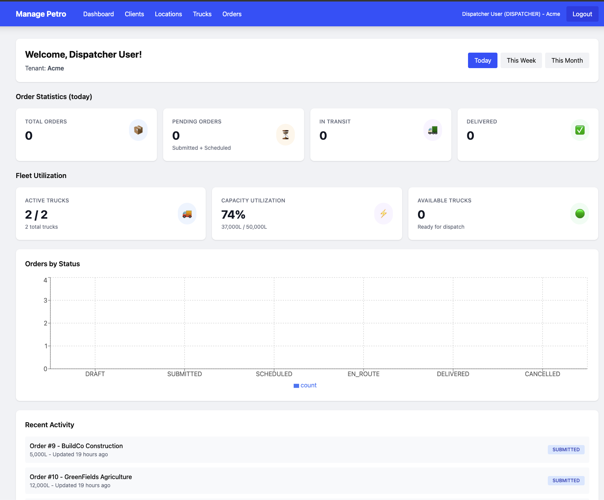
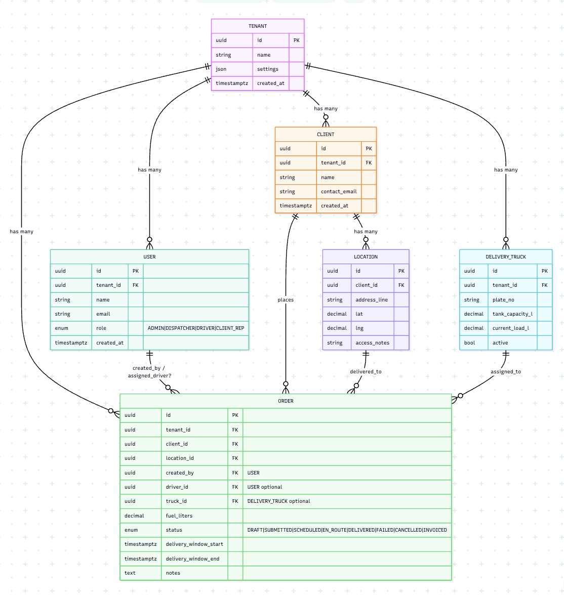
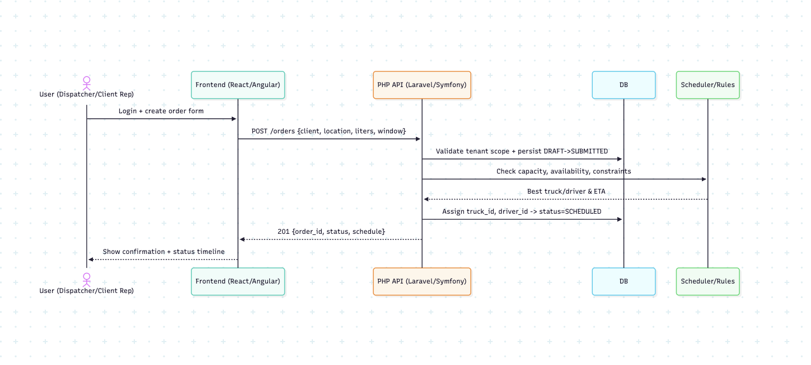
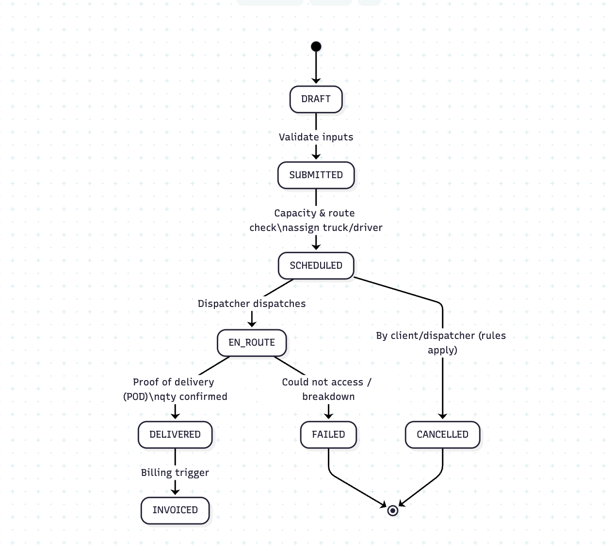
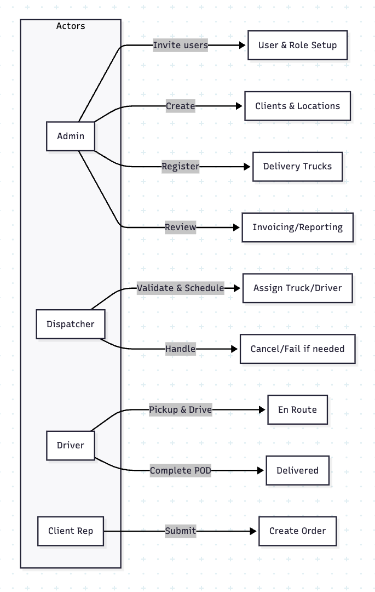

# 🚚 Manage Petro — Multi-Tenant Fuel Delivery Management

<div align="center">

[](https://laravel.com)
[](https://reactjs.org)
[](https://www.typescriptlang.org)
[](https://www.docker.com)
[](https://www.mysql.com)

**A production-ready multi-tenant SaaS application for managing fuel delivery operations with enterprise-grade security and scalability.**

[Features](#-features) •
[Quick Start](#-quick-start) •
[Architecture](#-architecture) •
[Documentation](#-documentation) •
[API](#-api-endpoints)

</div>

---

## 📸 Product Screenshots

### Dashboard Overview


**Key Features Shown:**
- 📊 **Order Statistics**: Real-time counts for Total Orders, Pending Orders, In Transit, and Delivered
- 🚛 **Fleet Utilization**: Active trucks (2/2), Capacity usage (74%), Available trucks ready for dispatch
- 📈 **Visual Analytics**: Bar chart showing orders by status (DRAFT, SUBMITTED, SCHEDULED, EN_ROUTE, DELIVERED, CANCELLED)
- 🔔 **Recent Activity**: Live feed showing latest order updates (BuildCo Construction, GreenFields Agriculture)
- 🕐 **Time Filters**: Toggle between Today, This Week, This Month views
- 👤 **User Context**: Displays current user role (Dispatcher) and tenant (Acme)

### Order Management


**Key Features Shown:**
- 📋 **Order List**: Complete table view with all order details (ID, Client, Location, Liters, Status, Truck, Actions)
- 🎨 **Status Indicators**: Color-coded badges for different order statuses
  - 🔵 **SUBMITTED** - Orders awaiting scheduling (BuildCo Construction, GreenFields Agriculture, North Site)
  - 🟣 **SCHEDULED** - Truck assigned (RockSolid Mining Co, South Site)
  - 🟡 **EN_ROUTE** - Driver dispatched (FastTrack Logistics, South Site)
  - 🟢 **DELIVERED** - Completed deliveries (Metro Transport, BuildCo, FastTrack, North Site)
- ⚡ **Quick Actions**: Schedule, Dispatch, Cancel buttons for each order
- 🏢 **Diverse Clients**: Shows the 7 different ACME clients (BuildCo, GreenFields, RockSolid, FastTrack, Metro Transport, North/South Sites)
- 📍 **Location Details**: Full addresses for each delivery location
- 🚚 **Truck Assignment**: Displays assigned trucks (ACME100, ACME200) or "-" for unassigned
- 🎯 **Create New**: Prominent "Create Draft Order" button for quick order creation

---

## 📋 Table of Contents

- [Screenshots](#-product-screenshots)
- [Overview](#-overview)
- [Features](#-features)
- [Tech Stack](#-tech-stack)
- [Quick Start](#-quick-start)
- [Architecture](#-architecture)
- [Project Structure](#-project-structure)
- [API Endpoints](#-api-endpoints)
- [Git Hooks & Quality](#-git-hooks--code-quality)
- [Database Schema](#-database-schema)
- [Development](#-development)
- [Testing](#-testing)
- [Deployment](#-deployment)
- [Contributing](#-contributing)

---

## 🎯 Overview

Manage Petro is a comprehensive multi-tenant fuel delivery management system built with modern web technologies. It provides complete tenant isolation, robust security, and a scalable architecture suitable for SaaS deployment.

### Key Highlights

- 🏢 **Multi-Tenancy**: Database-level tenant isolation with composite foreign keys
- 🔐 **Enterprise Security**: Laravel Sanctum authentication with role-based access control
- 🎨 **Modern UI**: React 18 with TypeScript and Tailwind CSS
- 🐳 **Containerized**: Full Docker setup with Docker Compose orchestration
- 🧪 **Quality Assured**: Automated testing and Git hooks for code quality
- 📊 **Data Integrity**: Comprehensive validation and database constraints
- ⚡ **Fast Development**: Hot module replacement with Vite
- 🔄 **Real-time Ready**: Built with WebSocket support in mind

---

## ✨ Features

### Core Functionality

- ✅ **Multi-Tenant Architecture**: Slug-based routing with complete data isolation
- ✅ **Authentication & Authorization**: Role-based access control (Admin, Dispatcher, Driver, Client Rep)
- ✅ **Real-time Dashboard**:
  - Order statistics (Total, Pending, In Transit, Delivered)
  - Fleet utilization tracking (Active trucks, Capacity usage)
  - Available trucks for dispatch
  - Recent activity feed with order updates
  - Visual charts for order status distribution
- ✅ **Client Management**: Manage business clients with contact information
- ✅ **Location Management**: Track delivery locations with geolocation support
- ✅ **Fleet Management**: Manage delivery trucks with capacity tracking
- ✅ **Order Management**:
  - Full order lifecycle from creation to delivery
  - Comprehensive order list with filtering
  - Status-based color coding (Submitted, Scheduled, En Route, Delivered)
  - Bulk operations and quick actions
  - Truck assignment and driver dispatch
- ✅ **Order Workflow**: Status transitions (Draft → Submitted → Scheduled → En Route → Delivered/Cancelled)
- ✅ **Activity Logging**: Track all system activities for audit trails

### UI/UX Features

- 🎨 **Modern Interface**: Clean, intuitive design with Tailwind CSS
- 📱 **Responsive Design**: Works seamlessly on desktop, tablet, and mobile
- 🎯 **Role-Based Views**: Customized interface based on user role
- 🔔 **Real-time Updates**: Live activity feed for order changes
- 📊 **Data Visualization**: Interactive charts using Recharts
- 🎨 **Status Color Coding**: Visual indicators for order status
  - 🔵 Blue for SUBMITTED orders
  - 🟣 Purple for SCHEDULED orders
  - 🟡 Yellow for EN_ROUTE orders
  - 🟢 Green for DELIVERED orders
- 🔍 **Smart Filtering**: Filter orders by status, client, date range
- ⚡ **Quick Actions**: One-click schedule, dispatch, and cancel operations
- 📈 **Fleet Metrics**: Real-time capacity utilization tracking
- 🕐 **Time Period Filters**: View data by Today, This Week, This Month

### Technical Features

- 🔒 **Database-Level Isolation**: Composite foreign keys prevent cross-tenant data access
- 🎨 **Code Quality**: Laravel Pint for consistent code style
- 🧪 **Automated Testing**: PHPUnit test suite with parallel execution
- 🪝 **Git Hooks**: Pre-commit, pre-push, and commit-msg validation
- 📝 **API Documentation**: RESTful API with consistent response format
- 🔄 **Hot Reload**: Vite dev server for instant feedback
- 📦 **Modular Architecture**: Clean separation of concerns with domain-driven design
- 🚀 **Production Ready**: Optimized Docker containers and build process

---

## 🛠 Tech Stack

### Backend

| Technology | Version | Purpose |
|------------|---------|---------|
| **Laravel** | 11.x | PHP framework with elegant syntax |
| **PHP** | 8.2+ | Modern PHP with type declarations |
| **MySQL** | 8.0 | Relational database with composite keys |
| **Redis** | 7.x | Caching and session storage |
| **Laravel Sanctum** | 4.x | API authentication |
| **Laravel Pint** | 1.x | Code style fixer |
| **PHPUnit** | 11.x | Testing framework |

### Frontend

| Technology | Version | Purpose |
|------------|---------|---------|
| **React** | 18.x | UI library with hooks |
| **TypeScript** | 5.x | Type-safe JavaScript |
| **Vite** | 5.x | Fast build tool and dev server |
| **Tailwind CSS** | 3.x | Utility-first CSS framework |
| **React Router** | 6.x | Client-side routing |
| **Axios** | 1.x | HTTP client |
| **Recharts** | 2.x | Data visualization |
| **date-fns** | 3.x | Date manipulation |

### Infrastructure

| Technology | Purpose |
|------------|---------|
| **Docker** | Containerization |
| **Docker Compose** | Multi-container orchestration |
| **Nginx** | Web server and reverse proxy |
| **PHP-FPM** | FastCGI process manager |
| **Node.js** | Frontend build tools |

---

## 🚀 Quick Start

### Prerequisites

- Docker Desktop (20.10+)
- Git
- Make (optional, but recommended)

### Installation

#### Option 1: Using Makefile (Recommended)

```bash
# Clone the repository
git clone <repository-url>
cd manage-petro

# Complete setup with one command
make install
```

That's it! The `make install` command will:
- ✅ Copy `.env.example` to `.env`
- ✅ Start Docker containers
- ✅ Install PHP dependencies (Composer)
- ✅ Install Node dependencies (npm)
- ✅ Generate application key
- ✅ Run database migrations
- ✅ Seed demo data (2 tenants with full data)

#### Option 2: Manual Setup

```bash
# 1. Copy environment file
cp .env.example .env

# 2. Start Docker containers
docker compose up -d --build

# 3. Install backend dependencies
docker compose exec php composer install
docker compose exec php php artisan key:generate

# 4. Install frontend dependencies
docker compose exec node npm install

# 5. Run migrations and seed database
docker compose exec php php artisan migrate --seed
```

### Access the Application

| Tenant | URL | Description |
|--------|-----|-------------|
| **Acme Fuel** | http://localhost:8000/acme/login | First demo tenant |
| **Globex Energy** | http://localhost:8000/globex/login | Second demo tenant |

### Test Credentials

For each tenant (replace `{tenant}` with `acme` or `globex`):

| Role | Email | Password | Permissions |
|------|-------|----------|-------------|
| **Admin** | `admin@{tenant}.test` | `password` | Full system access |
| **Dispatcher** | `dispatcher@{tenant}.test` | `password` | Manage orders, clients, locations |
| **Driver** | `driver@{tenant}.test` | `password` | View and deliver assigned orders |
| **Client Rep** | `clientrep@{tenant}.test` | `password` | View orders for their client |

### Starting Development

```bash
# Start Vite dev server for hot reload
make dev

# Or run in background
make dev-bg

# View all available commands
make help
```

---

## 🏗 Architecture

### High-Level Overview

```
┌─────────────┐      ┌──────────────┐      ┌───────────────┐
│   Browser   │─────▶│    Nginx     │─────▶│   PHP-FPM     │
│  (React)    │      │ (Port 8000)  │      │   (Laravel)   │
└─────────────┘      └──────────────┘      └───────────────┘
                              │                      │
                              │                      ▼
                              │              ┌───────────────┐
                              │              │     MySQL     │
                              │              │  (Port 3306)  │
                              │              └───────────────┘
                              │                      │
                              ▼                      │
                      ┌──────────────┐              │
                      │  Vite Dev    │              │
                      │  (Port 5173) │              │
                      └──────────────┘              │
                                                     ▼
                                              ┌───────────────┐
                                              │     Redis     │
                                              │  (Port 6379)  │
                                              └───────────────┘
```

### Multi-Tenancy Architecture

The application uses **slug-based tenancy** with database-level isolation:

```
Request: http://localhost:8000/acme/dashboard
                                  ↓
         TenantMiddleware extracts "acme" from URL
                                  ↓
         Loads Tenant model from database
                                  ↓
         Sets tenant in container (app()->instance('tenant', $tenant))
                                  ↓
         BelongsToTenant trait applies global scope
                                  ↓
         All queries automatically filtered by tenant_id
```

**Key Benefits:**
- 🔒 **Security**: Database constraints prevent cross-tenant queries
- ⚡ **Performance**: Single database with efficient indexing
- 🎯 **Simplicity**: Automatic tenant context in all models
- 📊 **Analytics**: Easy cross-tenant reporting for admin

### Modular Structure

The application follows a **domain-driven modular architecture**:

```
app/Modules/
├── Auth/                    # Authentication & session management
├── Clients/                 # Client management domain
├── Locations/               # Delivery location management
├── Trucks/                  # Fleet management
├── Orders/                  # Order lifecycle management
├── ActivityLog/             # Audit trail & activity tracking
└── Shared/                  # Shared utilities & base classes
    ├── Concerns/            # Traits (BelongsToTenant)
    ├── Http/                # Base controllers & responses
    └── Tenancy/             # Tenant middleware
```

Each module contains:
- `Domain/Models/` - Eloquent models
- `Domain/Enums/` - Enum classes
- `Services/` - Business logic
- `Http/Controllers/` - API endpoints
- `Http/Requests/` - Form validation
- `Http/Resources/` - API transformers

### Database Schema

See our comprehensive database diagrams:

#### Entity Relationship Diagram


#### Relationships


#### Order Status Flow


#### Permission Matrix


### Composite Foreign Keys

The system uses **composite foreign keys** for tenant isolation:

```sql
-- Orders table example
CREATE TABLE orders (
    id BIGINT PRIMARY KEY,
    tenant_id BIGINT NOT NULL,
    client_id BIGINT NOT NULL,
    location_id BIGINT NOT NULL,

    -- Composite FK ensures client belongs to same tenant
    FOREIGN KEY (client_id, tenant_id)
      REFERENCES clients(id, tenant_id)
      ON DELETE RESTRICT,

    -- Composite FK ensures location belongs to same tenant
    FOREIGN KEY (location_id, tenant_id)
      REFERENCES locations(id, tenant_id)
      ON DELETE RESTRICT,

    -- Composite index for tenant queries
    INDEX idx_tenant_status (tenant_id, status)
);
```

**Benefits:**
- ✅ Prevents cross-tenant references at database level
- ✅ Even malicious queries can't access other tenant data
- ✅ Referential integrity maintained within tenant boundaries

---

## 📁 Project Structure

```
manage-petro/
├── .githooks/               # Git hooks for code quality
│   ├── pre-commit           # Syntax, style, debug checks
│   ├── pre-push             # Run tests before push
│   ├── commit-msg           # Validate commit messages
│   ├── install.sh           # Hook installation script
│   └── README.md            # Hooks documentation
├── app/
│   ├── Http/
│   │   └── Controllers/
│   │       └── Controller.php
│   ├── Models/
│   │   ├── Tenant.php       # Tenant model
│   │   └── User.php         # User model with roles
│   ├── Modules/             # Domain modules
│   │   ├── Auth/
│   │   ├── Clients/
│   │   ├── Locations/
│   │   ├── Trucks/
│   │   ├── Orders/
│   │   ├── ActivityLog/
│   │   └── Shared/
│   └── Policies/            # Authorization policies
├── database/
│   ├── factories/           # Model factories
│   ├── migrations/          # Database migrations
│   └── seeders/
│       └── DemoMultiTenantSeeder.php
├── docs/                    # Documentation & diagrams
│   ├── ERD.png
│   ├── relationship.png
│   ├── order_status.png
│   └── permissions.png
├── resources/
│   ├── css/
│   │   └── app.css          # Tailwind CSS
│   ├── js/
│   │   ├── app.tsx          # React entry point
│   │   ├── router.tsx       # React Router config
│   │   ├── components/      # Reusable UI components
│   │   ├── lib/             # Utilities & hooks
│   │   │   ├── api.ts       # Axios API client
│   │   │   └── useTenant.ts # Tenant context hook
│   │   └── pages/           # Page components
│   │       ├── Login.tsx
│   │       ├── Dashboard.tsx
│   │       ├── Orders/
│   │       ├── Clients/
│   │       └── ...
│   └── views/
│       └── app.blade.php    # Main HTML template
├── routes/
│   ├── api.php              # API routes
│   └── web.php              # Web routes (SPA fallback)
├── tests/
│   ├── Feature/             # Integration tests
│   └── Unit/                # Unit tests
├── docker/                  # Docker configuration
├── docker-compose.yml       # Container orchestration
├── Dockerfile               # PHP container image
├── Makefile                 # Development commands
├── phpunit.xml              # PHPUnit configuration
├── vite.config.ts           # Vite configuration
├── tailwind.config.js       # Tailwind CSS config
└── README.md                # This file
```

---

## 🔌 API Endpoints

All API routes are prefixed with `/api/{tenant}/` and return consistent JSON responses.

### Response Format

```json
{
  "success": true,
  "message": "Operation successful",
  "data": { ... }
}
```

### Authentication

```http
POST /api/{tenant}/auth/login
Content-Type: application/json

{
  "email": "admin@acme.test",
  "password": "password"
}
```

```http
POST /api/{tenant}/auth/logout
Authorization: Bearer {token}
```

```http
GET /api/{tenant}/auth/me
Authorization: Bearer {token}
```

### Orders

```http
GET    /api/{tenant}/orders              # List all orders
POST   /api/{tenant}/orders              # Create order
GET    /api/{tenant}/orders/{id}         # Get order details
PUT    /api/{tenant}/orders/{id}         # Update order
DELETE /api/{tenant}/orders/{id}         # Delete order (draft only)

POST   /api/{tenant}/orders/{id}/submit  # Submit order
POST   /api/{tenant}/orders/{id}/schedule # Schedule order
POST   /api/{tenant}/orders/{id}/dispatch # Dispatch order
POST   /api/{tenant}/orders/{id}/deliver # Mark as delivered
POST   /api/{tenant}/orders/{id}/cancel  # Cancel order
```

### Clients

```http
GET    /api/{tenant}/clients             # List all clients
POST   /api/{tenant}/clients             # Create client
GET    /api/{tenant}/clients/{id}        # Get client details
PUT    /api/{tenant}/clients/{id}        # Update client
DELETE /api/{tenant}/clients/{id}        # Delete client
```

### Locations

```http
GET    /api/{tenant}/locations           # List all locations
POST   /api/{tenant}/locations           # Create location
GET    /api/{tenant}/locations/{id}      # Get location details
PUT    /api/{tenant}/locations/{id}      # Update location
DELETE /api/{tenant}/locations/{id}      # Delete location
```

### Trucks

```http
GET    /api/{tenant}/trucks              # List all trucks
POST   /api/{tenant}/trucks              # Create truck
GET    /api/{tenant}/trucks/{id}         # Get truck details
PUT    /api/{tenant}/trucks/{id}         # Update truck
DELETE /api/{tenant}/trucks/{id}         # Delete truck
```

---

## 🪝 Git Hooks & Code Quality

The project includes comprehensive Git hooks to ensure code quality:

### Available Hooks

| Hook | Trigger | Checks |
|------|---------|--------|
| **pre-commit** | Before commit | PHP syntax, code style (Pint), debug statements, merge conflicts |
| **pre-push** | Before push | Run tests, check for sensitive data, detect large files |
| **commit-msg** | After commit message | Message format, length, conventional commits |

### Installation

```bash
# Install hooks
make hooks-install

# Check hook status
make hooks-info

# Uninstall hooks
make hooks-uninstall
```

### Bypassing Hooks

```bash
# Skip all hooks (use with caution!)
git commit --no-verify -m "WIP: temporary commit"
git push --no-verify

# Skip only tests
SKIP_TESTS=1 git push
```

For complete documentation, see [`.githooks/README.md`](.githooks/README.md)

---

## 🗄 Database Schema

### Tables

| Table | Description | Key Features |
|-------|-------------|--------------|
| `tenants` | Multi-tenant base | Slug-based routing |
| `users` | System users | Role-based access (ADMIN, DISPATCHER, DRIVER, CLIENT_REP) |
| `clients` | Business clients | Contact information |
| `locations` | Delivery locations | Geolocation support |
| `delivery_trucks` | Fleet vehicles | Capacity tracking |
| `orders` | Delivery orders | Full lifecycle tracking |
| `activity_logs` | Audit trail | User action logging |

### Key Relationships

```
Tenant
  ├─► Users (1:many)
  ├─► Clients (1:many)
  ├─► Locations (1:many via Clients)
  ├─► Trucks (1:many)
  └─► Orders (1:many)

Order
  ├─► Client (many:1)
  ├─► Location (many:1)
  ├─► Truck (many:1, optional)
  ├─► Driver (many:1, optional)
  └─► Creator (many:1)
```

### Order Status Flow

```
DRAFT ──► SUBMITTED ──► SCHEDULED ──► EN_ROUTE ──► DELIVERED
            │              │              │
            │              │              └──► CANCELLED
            │              └─────────────────► CANCELLED
            └──────────────────────────────► CANCELLED
```

---

## 💻 Development

### Makefile Commands

The project includes a comprehensive Makefile for easy development:

```bash
make help                 # Show all available commands
```

#### Setup & Installation
```bash
make install              # Complete first-time setup
make setup                # Install dependencies only
make fresh                # Drop database, migrate, and seed
```

#### Docker Management
```bash
make up                   # Start all containers
make down                 # Stop all containers
make restart              # Restart containers
make ps                   # Show running containers
```

#### Database Operations
```bash
make migrate              # Run migrations
make seed                 # Seed database
make migrate-seed         # Migrate and seed
make migrate-fresh        # Fresh migrations (WARNING: deletes data)
make db-shell             # Access MySQL shell
```

#### Development Tools
```bash
make dev                  # Start Vite dev server (foreground)
make dev-bg               # Start Vite dev server (background)
make build                # Build frontend for production
make logs                 # Show all container logs
make logs-php             # Show PHP/Laravel logs
make logs-nginx           # Show Nginx logs
make logs-node            # Show Vite logs
make shell-php            # Access PHP container shell
make shell-node           # Access Node container shell
make tinker               # Open Laravel Tinker
```

#### Code Quality
```bash
make test                 # Run all tests
make test-coverage        # Run tests with coverage
make pint                 # Fix code style issues
make pint-test            # Check code style without fixing
make cache-clear          # Clear all Laravel caches
make routes               # List all routes
```

#### Git Hooks
```bash
make hooks-install        # Install Git hooks
make hooks-uninstall      # Uninstall Git hooks
make hooks-info           # Show hooks status
```

#### Quick Access
```bash
make open                 # Open Acme tenant in browser
make open-acme            # Open Acme tenant
make open-globex          # Open Globex tenant
```

### Manual Docker Commands

```bash
# Container access
docker compose exec php sh
docker compose exec node sh
docker compose exec mysql mysql -u mp -pmp manage_petro

# Artisan commands
docker compose exec php php artisan route:list
docker compose exec php php artisan tinker

# Composer/NPM
docker compose exec php composer require package/name
docker compose exec node npm install package-name

# View logs
docker compose logs -f php
docker compose logs -f nginx
```

---

## 🧪 Testing

### Running Tests

```bash
# Run all tests
make test

# Run with coverage
make test-coverage

# Run specific test suite
docker compose exec php php artisan test --testsuite=Feature
docker compose exec php php artisan test --testsuite=Unit

# Run specific test file
docker compose exec php php artisan test tests/Feature/OrderTest.php
```

### Test Coverage

The project includes tests for:
- ✅ Authentication flows
- ✅ Multi-tenant isolation
- ✅ Order lifecycle
- ✅ Authorization policies
- ✅ API endpoints
- ✅ Database constraints

### Writing Tests

```php
// tests/Feature/Orders/OrderTest.php
public function test_user_can_only_see_orders_from_their_tenant()
{
    $tenant1 = Tenant::factory()->create(['slug' => 'tenant1']);
    $tenant2 = Tenant::factory()->create(['slug' => 'tenant2']);

    $user1 = User::factory()->for($tenant1)->create();
    $order1 = Order::factory()->for($tenant1)->create();
    $order2 = Order::factory()->for($tenant2)->create();

    $response = $this->actingAs($user1)
        ->getJson("/api/tenant1/orders");

    $response->assertOk()
        ->assertJsonCount(1, 'data')
        ->assertJsonFragment(['id' => $order1->id])
        ->assertJsonMissing(['id' => $order2->id]);
}
```

---
### Build Process

```bash
# Build frontend assets
make build

# Clear and cache config
docker compose exec php php artisan config:cache
docker compose exec php php artisan route:cache
docker compose exec php php artisan view:cache

# Run migrations
docker compose exec php php artisan migrate --force
```


## 📚 Additional Documentation

- **Architecture Guide**: [`ARCHITECTURE.md`](ARCHITECTURE.md) - Detailed technical architecture, module structure, and design patterns
- **Git Hooks**: [`.githooks/README.md`](.githooks/README.md) - Complete Git hooks documentation
- **Quick Reference**: [`.githooks/QUICK_REFERENCE.md`](.githooks/QUICK_REFERENCE.md) - Quick reference for developers
- **API Documentation**: Coming soon
- **Deployment Guide**: Coming soon


